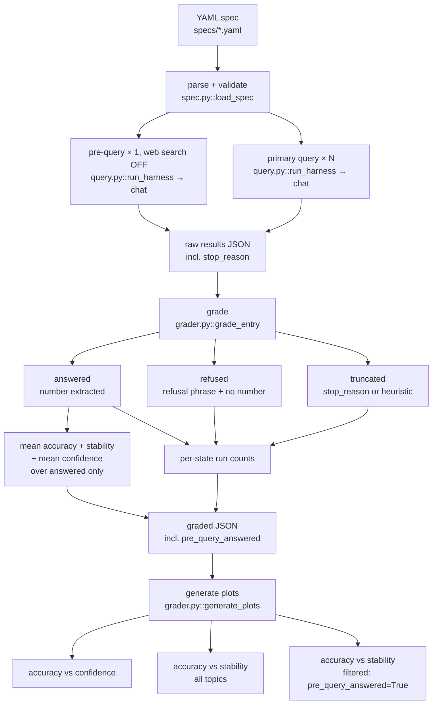

# Architecture

> **Status:** v1.0 — full pipeline implemented. Coverage check (pre-query), tiered numeric extraction, three-state per-run outcomes (answered / refused / truncated), and `stop_reason`-based truncation detection are all live. An alternate `structured` grader path (system-prompted terminal-block output, parsed directly) is also implemented; see [`docs/system_prompts.md`](system_prompts.md). The `exact` and `judge` graders are stubbed but not yet implemented; concurrency, caching, and multi-provider auth remain on the backlog.

## Design goal

Turn the two-step procedure from [*A Black-Box Procedure for LLM Confidence in Critical Applications*](https://www.lesswrong.com/posts/unaLT4A6hSTCLNGod/a-black-box-procedure-for-llm-confidence-in-critical#comments) into a runnable harness that any team can point at a chat-completion API and get a stability-based confidence signal back.

The harness optimises for one thing: making the procedure *easy to run repeatedly against many models*. It is not trying to be a general-purpose eval framework. The constraint of doing one thing well is deliberate — the LessWrong post argues stability is a useful signal *because* it is simple to measure, and a 10,000-line harness would betray that argument.

## The two-step procedure, made concrete

Step 1 — **training coverage check.** For each topic under test, ask a secondary question with web search explicitly disabled. The coverage check is judged by whether the model committed to a verifiable answer in the response (currently a recognisable game score in N-N or comma-separated form), not by refusal-phrase matching. A response that names the teams but refuses to commit to a score counts as not answered; a response that gives a score with hedging still counts as answered. Topics that fail the coverage check are kept in the output for diagnostic purposes but excluded from the filtered stability analysis.

Step 2 — **stability measurement.** For each topic, run the primary query N times (the LessWrong study used N=5; `runs` is a required spec field with no default) at a fixed temperature, and measure agreement across responses. The post's finding: stability after filtering is the strong predictor (R² ≈ 0.995); without filtering, the relationship is much weaker.

**Per-run outcome classification.** Within step 2, each of the N responses is classified as one of three states: **answered** (an extractable numeric answer is present), **refused** (a refusal phrase from the spec's pattern list is matched and no number was extracted), or **truncated** (the API reports `stop_reason: max_tokens`, or for legacy data without `stop_reason`, the response text shows mid-generation cut-off via a small set of heuristics). Only answered runs contribute to the stability and accuracy aggregates. The three states are mutually exclusive — a truncated response is never also flagged as refused, even if the truncated text happens to contain refusal-like phrasing. The counts are surfaced in the per-topic summary as `runs_with_extraction`, `runs_with_refusals`, and `runs_truncated`, and an `all_runs_accounted_for` flag confirms they sum to the run count.

The harness implements both steps as part of the same eval run. A spec that omits the pre-query on any topic fails validation; the harness will not run an eval that can produce unfiltered numbers.

## Flow

## Components

| Component | Purpose | Status |
|-----------|---------|--------|
| **Spec parser** | Load and validate a YAML eval spec. Enforces required fields, `temperature > 0`, presence of both pre-query and primary query. | Implemented |
| **Driver** | Execute the spec: run coverage checks, run primary queries N times per topic, capture `stop_reason` per response, retry on transient rate-limit and overload errors, paced sleeps between calls. | Implemented (single-provider; no parallelism) |
| **Grader — numeric** | Extract the model's committed numeric answer via a tiered scoring system (bold-with-label > bold or label-line > equals-sign > fallback) with rate-mention filtering and range-midpoint handling. Score accuracy against truth from the spec. | Implemented |
| **Grader — structured** | Alternate path selected by `grader.type: structured`. System prompts (defined per-query in the spec) force the model under test to emit a fixed `=== ANSWER ===` terminal block, which `grader_structured.py` parses directly — no extraction heuristics. Emits four plots instead of three. See [`docs/system_prompts.md`](system_prompts.md). | Implemented |
| **Grader — exact / judge** | String-match and LLM-as-judge graders for non-numeric answers. Not yet implemented; specs requesting them currently fall back to the numeric grader. | Planned |
| **Truncation detection** | Classify each response as truncated via `stop_reason == "max_tokens"` (definitive) or, for legacy data, a text heuristic over the final characters. Truncated runs have their extracted value forced to `None`. | Implemented |
| **Metrics** | Mean accuracy of extracted runs; stability as `1 − stdev/mean` of extracted values (≥2 valid runs required); mean confidence across runs that produced both an answer and a percentage. | Implemented |
| **Reporter** | Emit a single JSON file per eval session containing per-run responses, per-topic summary, and three accuracy plots (vs confidence, vs stability, vs stability filtered to `pre_query_answered=True`). | Implemented |

## Spec format

A spec is a YAML file describing one eval run. The minimum useful spec has:

- `models` — list of model strings to run against (e.g. `claude-haiku-4-5`).
- `topics` — list of topic objects, each with `league`, `year`, and `truth`. Both queries (pre-query and primary) are defined once at the top level under `queries:` and templated with `{league}` and `{year}`; the pre-query is required.
- `runs` — N, the number of times to run the primary query per topic per model. Required.
- `temperature` — sampling temperature. Validated as `> 0` at spec-load time. Defaults to 1.0 to match claude.ai's apparent default per third-party measurement; the original LessWrong study used claude.ai. Setting this to 0 defeats the point of the harness — stability at temperature 0 is trivially high and uninformative.
- `grader` — `exact`, `numeric`, `judge`, `none`, or `structured`, plus `expected_unit` and `refusal_patterns`. The `structured` path additionally reads per-query `system_prompt` fields and an optional `soft_token_budget`; see [`docs/system_prompts.md`](system_prompts.md).

The runner records `stop_reason` from the API on every response (both pre-query and primary) starting in v1.0. Older raw files predating this don't carry the field; the grader falls back to a text heuristic for those.

See [`specs/example.yaml`](../specs/example.yaml).

## Open questions

- **Grader judge model.** When `grader: judge`, which model judges? Same model under test? A held-out model? The latter is methodologically cleaner but doubles the API surface.
- **Caching.** A repeated run of the same spec against the same models should not repay the API cost. Cache key is the spec hash plus the model string plus the run index. Filesystem cache by default; pluggable.
- **Per-model token budgets.** A fixed `max_tokens` across models confounds model capability with token-budget headroom — Sonnet's truncation rate on long-form prompts is materially higher than Haiku's at the same cap. Should `max_tokens` move into the spec as a per-model override?
- **Concurrency.** The current driver runs serially with paced sleeps between calls. A token-bucket-per-provider scheme would be faster without tripping rate limits, at the cost of more state to manage. Deferred until the harness is regularly used at a scale that makes the wait painful.
- **Multi-provider auth.** Each provider has its own env var convention. The harness should fail loudly and early when a configured model has no credentials, rather than silently producing partial results. Currently the driver only supports Anthropic.
- **Heuristic vs API truncation detection on fresh data.** The grader trusts `stop_reason` when present and falls back to the text heuristic only for legacy data. Worth deciding whether the heuristic should also serve as a sanity check on fresh data — e.g., flag a warning when the heuristic detects truncation but the API reports `end_turn`, which would indicate a model that finished but didn't actually complete its answer.

## Resolved (kept here briefly for history)

- **Stability metric.** Settled on `1 − stdev/mean` of extracted numeric values, as in the LessWrong post. Pairwise agreement rate and embedding-based semantic clustering were considered but not implemented; the simpler metric was sufficient to reproduce the post's R² findings.
- **Mandatory coverage check.** Implemented in v1.0; spec validation fails if the pre-query is missing.