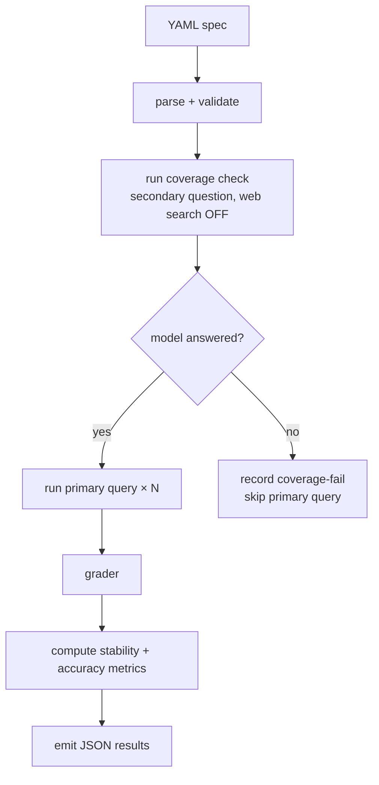

# Architecture

> **Status:** v0.1 — bare driver + grader implemented. v0.2 will add the mandatory coverage check; specs without coverage_check will not validate.

## Design goal

Turn the two-step procedure from [*A Black-Box Procedure for LLM Confidence in Critical Applications*](https://www.lesswrong.com/posts/unaLT4A6hSTCLNGod/a-black-box-procedure-for-llm-confidence-in-critical#comments) into a runnable harness that any team can point at a chat-completion API and get a stability-based confidence signal back.

The harness optimises for one thing: making the procedure *easy to run repeatedly against many models*. It is not trying to be a general-purpose eval framework. The constraint of doing one thing well is deliberate — the LessWrong post argues stability is a useful signal *because* it is simple to measure, and a 10,000-line harness would betray that argument.

## The two-step procedure, made concrete

Step 1 — **training coverage check.** For each topic under test, ask a secondary question with web search explicitly disabled. If the model refuses or hedges substantially, the topic is outside the model's training coverage and downstream stability measurements on that topic are not meaningful. Filtered out.

Step 2 — **stability measurement.** For each surviving topic, run the primary query N times (default N=20) at a fixed temperature, and measure agreement across responses. The post's finding: stability after filtering is the strong predictor (R² ≈ 0.995); without filtering, the relationship is much weaker.

The harness implements both steps as part of the same eval run. A spec that omits coverage_check on any topic fails validation; the harness will not run an eval that can produce unfiltered numbers.

## Flow

## Components

| Component | Purpose | Status |
|-----------|---------|--------|
| **Spec parser** | Load and validate a YAML eval spec. | Stub |
| **Driver** | Execute the spec: run coverage checks, run primary queries N times in parallel, manage rate limits. | Partial |
| **Grader** | Score each response. Three grader types: `numeric` (regex extraction with unit awareness — implemented), `exact` (string match — planned), `judge` (LLM-as-judge for open-ended answers — planned). | Partial |
| **Metrics** | Compute stability (agreement rate across N runs) and, when ground truth is supplied, accuracy. | Partial |
| **Reporter** | Emit JSON, one file per eval session, containing per-run responses and a summary block. | Partial |

## Spec format

A spec is a YAML file describing one eval run. The minimum useful spec has:

- `models` — list of model strings to run against (e.g. `claude-haiku-4-5`).
- `topics` — list of topic objects, each with `name`, `primary_query`, `coverage_check`, and `ground_truth`. `coverage_check` is required; topics that omit it cause the spec to fail validation.
- `runs` — N, the number of times to run the primary query per topic per model. Defaults to 20.
- `temperature` — sampling temperature. Defaults to 1.0 to match claude.ai's apparent default per third-party measurement; original LessWrong study used claude.ai. Setting this to 0 defeats the point of the harness — stability at temperature 0 is trivially high and uninformative.
- `grader` — `exact`, `numeric`, `judge`, or `none`.

See [`specs/example.yaml`](../specs/example.yaml).

## Open questions

- **Grader judge model.** When `grader: judge`, which model judges? Same model under test? A held-out model? The latter is methodologically cleaner but doubles the API surface.
- **Stability metric.** Pairwise agreement rate is the obvious choice. Semantic clustering (using embedding distance) is more sophisticated but adds an embeddings dependency. Probably start with agreement rate, add clustering later.
- **Caching.** A repeated run of the same spec against the same models should not repay the API cost. Cache key is the spec hash plus the model string plus the run index. Filesystem cache by default; pluggable.
- **Concurrency and rate limits.** Naively firing N×M×T requests in parallel will trip every provider's rate limit. The driver needs a token bucket per provider. Deferred to v0.2 alongside the coverage check.
- **Multi-provider auth.** Each provider has its own env var convention. The harness should fail loudly and early when a configured model has no credentials, rather than silently producing partial results.
